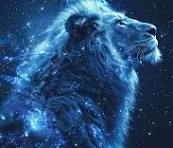

# Lion

Le lion est un gros chat paresseux.

Une image avec une légende:

## Caractéristique
- Il mange de la bonne viande fraiche label rouge
- Il est sauvage 
- On le trouve généralement dans son mirroir quand on a confiance en soi.

## Sous espèces
1. Le chat
2. Le Jaguar
3. Le puma
